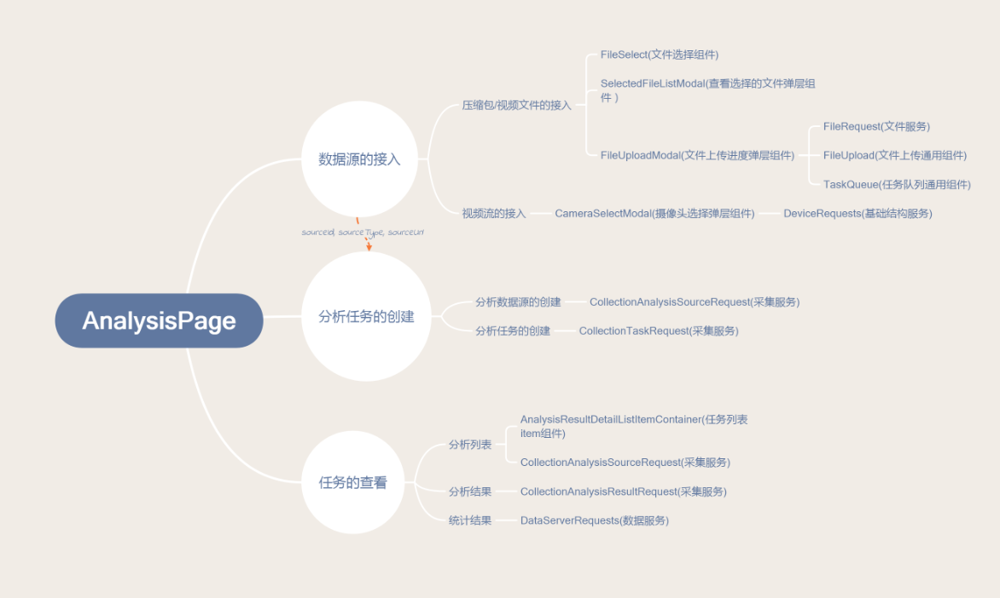
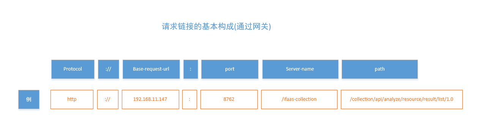
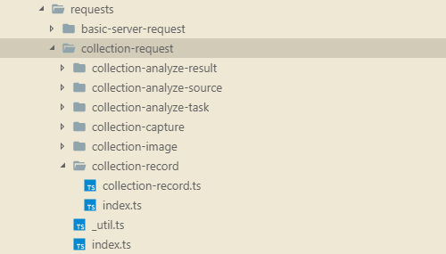

# 视频结构化前端设计文档

[](https://github.com/facebook/react) [](https://github.com/facebook/react) [](https://github.com/facebook/react) [](https://github.com/facebook/react) [](https://github.com/facebook/react) [](https://github.com/facebook/react) [](https://github.com/facebook/react) [](https://github.com/facebook/react) [](https://github.com/facebook/react) [](https://github.com/facebook/react)


## 更新记录

* 2018.9.4
  * 项目框架说明
  * 项目中数据分析，数据搜索，实时事件的流程图
  * 组件的定义-初版
* 2018.11.19
  * 新增名词定义
  * 修改模块(文件夹)的结构
* 2019.3.3
  * 新增名词定义
  * 二期需求对应的实现方案

## 概述

### 编写目的

略。

### 项目背景

大家别吵，让我们听听产品的看法。

### 项目分析

"你就说，这个能不能实现。"

## 设计原则

### 分层设计

从功能层面来划分，我们将从应用层面的功能到底层的依赖库，我们一共分做四层，下面是他们的模型：

> 注：我们用数字```0, 1, 2, 3```来表示不同的层级，因为分层设计体现在整个项目之中，在后续的文档中，如有应用分层设计的原则，我们也会用对应的数字标明出来。


层只与相邻的层级发生同行，相隔的层级之间不会感知对方的存在。下面我们来具体说明一下：

| 层级  | 层级说明                                                     | 备注 |
| ----- | ------------------------------------------------------------ | ---- |
| 第0层 | **第三方依赖**<br />我们代码中的实际依赖项                   |      |
| 第1层 | **项目的基础库**。<br />向下封装第三方库，向上提供统一的基础库接口，一方面可以对第三方库进行一定的修改，如结构化项目中，我们需要对```antd```进行封装，调整其样式；另一方面使得业务库和应用层与第三方依赖解耦，在跟换第三方库之后并不会影响上层的逻辑，如地图的切换。 |      |
| 第2层 | **业务库**<br />业务逻辑中会复用的一些逻辑，依赖于基础组件库 |      |
| 第3层 | **应用层**<br />具体的业务逻辑                               |      |

> 核心一句话：面向接口编程

### 模块化组织

我们以文件夹来组织模块，一个文件夹就是一个模块。

模块遵循的原则有：

* 高内聚
* 低耦合

在这两个原则之下，我们组织模块文件夹遵循：

* 模块自身应该尽可能的拥有相关的所有资源。不排除一些特殊情况，如运维的需求，打包资源的大小等，使得模块需要从外界引入资源。
* 模块的全局依赖尽可能的少。尽量不要在模块里边使用全局变量，需要引入的库尽可能的使用import导入。
* 模块对外通过```index```文件向外暴露接口。通过```index```暴露接口，可以在不修改外部引用的情况下修改模块内部的实现。
* 模块自身应该有测试模块。
* 模块可以拥有子模块。对于相关性较强，且在别处没有使用的模块，可以以子模块的形式组织，方便引用。

按照这些原则，一个标准模块的结构如下：

```
|--module-name
|  |--index.ts(js)      // 导出模块有关的资源
|  |--src               // 源码
|  |  |--module-name    // 相应的实现，具体的内容在对应的模块中介绍
|  |  |--******         // 其他有关的文件，可选
|  |  |--assets         // 资源（如果资源不多，可以把这个文件夹里边的资源扁平化）
|  |  |  |--styles      // 样式
|  |  |  |--images        // 图片
|  |  |  |--locales        // 国际化
|  |  |  |  |--zh-CN.js   // 模块国际化的中文配置部分
|  |  |  |  |--en-US.js   // 模块国际化的中文配置部分
|  |  |--submodules     // 嵌套的子模块
|  |  |  |--sub-module-name  
|  |--__tests__          // 测试目录
```

### 前后端分离

前后端分离可能有多种理解，我们这儿的意思是使得前端业务逻辑跟后端的响应结构分离开来，这需要前端作出额外的一些工作量，但从长远来看，这个工作量的值得的。原因有三：

* 对接任务变得简单，不同的分工只需要管好自己的事情，前后端关心点只集中在```接口```上。
* 提高并行开发的效率，可以使得在没有后端，或者后端不靠谱的前提下前端依然可以自测和运行，来保障前端的稳定
* 可以使得前端业务层逻辑跟请求层逻辑独立，不在相互制约，增强前端的可扩展性。

主要涉及的部分有：

* 提供适配层
* 前端的```请求mock```（没有精力去做）
* 代理工具```charles```

## 概要设计

### 名词定义

| 名词             | 释义                                                         | 类型/结构                                                  | 备注                                                         |
| ---------------- | ------------------------------------------------------------ | ---------------------------------------------------------- | ------------------------------------------------------------ |
| 数据源(analysis) | 进行数据分析的数据                                           | `IFAnalysisSourceProfileInfo`,`IFAnalysisSourceDetailInfo` | 分别表示数据源`简略`和`详情`信息                             |
| 数据源类型       | 数据源的类型                                                 | `ESourceType`                                              | 目前有```实时视频```,```离线视频```,```批量图片```           |
| 分析任务         | 对数据源进行的解析任务                                       | `IFAnalysisTaskInfo`                                       |                                                              |
| 结构化对象的类型 | 表明某对象是人脸，人体，还是其他的类型等等                   | ```ETargetType```                                          | 目前有<br />```Face```,<br />```Body```,<br />```Handbag```,<br />`Car` |
| 大图             | 上传的图片称之为大图，为原始图片，属于数据源的一部分         | -----                                                      | 前端代码中带有```original***```的字样，即表明跟大图有关的属性 |
| 小图             | 对应的检测结果的图片，如人脸，人体的图片，属于结构化对象的一部分 | -----                                                      | 前端代码中带有```target****```字样，即表明跟小图有关的属性   |
| 结构化数据       | 用来表示具体的结构化对象的数据描述                           | ```IFStructuralInfo```                                     | 可以查看后文中关于结构化数据的具体描述                       |
| 关联的结构化数据 | 用来表示多个有关的结构化对象的数据描述                       | `IFStructuralLinkInfo`                                     | 可以查看后文中关于此部分的具体描述                           |
| 属性             | 结构化信息会携带有很多的属性描述，如```性别属性的描述```, ```上衣颜色属性的描述``` | ```IFAttributeProperty```                                  | 具体可见后文关于属性的描述                                   |
| 属性组           | 相同类别的属性组合成的结构                                   | `IFAttributeGroupProperty`                                 |                                                              |
| 搜索目标         | 检索的目标，一般由结构化的人脸，人体等组成                   | ------                                                     | 命名为`SearchTargets****`                                    |
| 查询范围         | 请求采集，检索结果时指定的查询范围，为一些数据源组成         | ------                                                     | 命名为`SearchRange***`                                       |
| 行为布控         |                                                              |                                                            |                                                              |

### 技术选型

| 选型               | 说明                        | 类别     | 备注 |
| ------------------ | --------------------------- | -------- | ---- |
| ```React```        | ```JS框架```                | 框架     |      |
| ```React-Router``` | ```JS框架```                | 框架     | 路由 |
| ``less/sass``      | ```CSS预处理```             |          |      |
| ```css module```   |                             |          |      |
| ```typescript```   |                             |          |      |
| ```jest```         | ```测试框架```              | 测试     |      |
| ```faker```        | mock数据                    | 测试     |      |
| ```axios```        | ```http请求库```            |          |      |
| ```antd```         | ```UI组件库```              | UI框架   |      |
| ```storybook```    | ```UI组件开发环境```        |          |      |
| ```webpack```      | ```打包工具```              |          |      |
| ```eslint```       | ```代码质量检查```          | 代码质量 |      |
| ```prettier```     | ```代码格式化```            | 代码质量 |      |
| ```editorconfig``` | ```编辑器设置```            | 代码质量 |      |
| ```stylelint```    | ```css/less/sass质量检查``` | 代码质量 |      |
| ```lint-staged```  | ```代码提交时的质量检查```  | 代码质量 |      |
| `Redux`            |                             | 状态管理 | v2   |

### 开发环境

| 环境          | 用途             | 类别 | 备注 |
| ------------- | ---------------- | ---- | ---- |
| ```vscode```  | 编辑器           |      |      |
| ```postman``` | 接口测试         |      |      |
| ```chrome```  | 运行环境         |      |      |
| ```charles``` | 请求代理工具     |      |      |
| ```express``` | ```node服务器``` |      |      |

### 项目结构

整体文件结构如下图所示：


### 业务模块

从业务层面上分析，整个系统可以拆分成四个主要模块，分别是```分析模块```, ```检索模块```, ```布控模块```以及```管理模块```。下边分别叙述。

#### 分析模块

此模块以提供数据源进行解析为主要功能点，对应于界面中的```数据查看```部分，其主要逻辑有

1. 选择数据源
2. 创建解析任务
3. 展示解析任务

接入数据源根据数据源的来源，分为```压缩包(导入批量图片)```, ```视频文件(导入离线视频)```, ```视频流(导入实时视频)```。

创建解析任务细化下来分为两步，首先```创建分析任务的数据源```，然后```创建分析任务```。具体逻辑见详情设计。

展示解析任务，则是集中在用户的交互上边，通过页面提供给用户不同的过滤条件选项后，发送请求并展示出来。

主要结构如下：



#### 检索模块

此模块为以图搜图，并支持对多种属性进行过滤的操作。对应于界面中的```目标搜索```部分，主要逻辑有：

1. 搜索操作前(数据查看逻辑)
   1. 指定```查看范围```
   2. 指定```属性过滤条件```
   3. 展示结果
2. 搜索操作(搜索逻辑)
   1. 指定```搜索目标```
   2. 指定```搜索范围```
   3. 指定```搜索的属性过滤条件```
   4. 展示结果

检索模块是```数据查看```和```单纯的检索```的综合体，从上边列出来的数据查看和搜索逻辑来看，除了检索多了```搜索目标```之外，其余的操作都是一样的，也共用同一套UI逻辑，这部分具体的操作设计见详情设计。

主要结构如下：


#### 布控模块

此模块支持对不同行为进行布控告警（暂只支持骑行布控），对应于页面中的```实时告警```, 主要逻辑：

1. 布控
2. 查看视频流
3. 告警消息的展示

主要结构为：


#### 管理模块

此模块用来对系统其他模块进行管理，主要有：

1. 账号管理
2. 单位管理
3. 权限管理
4. 摄像头管理
5. 数据管理
6. 记录查询

管理页面展示已```table```为主，调用不同服务的接口来实现```增删改查```操作。具体见详情设计部分。

## 系统设计

### 路由系统
采用```React-Router```作为框架的路由，对应在项目中，涉及的路由如下：


### 数据流

#### Props

基础的数据流，也是整个系统中最为普遍使用的。在**父子**层级间传递数据和事件。在我们的系统中，所有的组件都有通过```props```接受外界的数据。

> 注意：子组件一定不要修改props。

#### Context

克服使用```props```时数据的多层传递，能够跨层级，从上层组件传递给下层组件。系统中```登陆的用户信息（userInfo)```通过```context```传递。

#### Event

因为```context```只能从上往下传，对于从下往上传，且需要跨越多层组件的数据则无能为力。在```拖动结构化组件```的事件中，我们通过```event```来向上传递数据。

### 配置项

> 整个配置分成三部分
>
> * 系统不可配置
> * 系统可配置
> * 用户自定义配置

#### 系统不可配置

> 位于```utils/config/SystemConfig.js```

```json
{
  "unconfigable" : {
    "version": "v1.0.0",
		"systemName": '视频结构化平台', //系统名称
  }
}
```

#### 系统可配置

> 位于```utils/config/SystemConfig.js```

```json
{
  	"configable": {
		"defaultLanguage": "zh-CN",
		// api请求地址配置
		"apiRequestAddress": {
			// 开发环境， 端口号根据不同的服务而不同， 具体可以参考http://192.168.2.150:8090/pages/viewpage.action?pageId=4293760
			'base-request': '127.0.0.1' // docker镜像构建时自动替换, 请确保打包后的文件名为main.******.js
		},
		"uriPrefix": '127.0.0.1:8889', // uri链接的前缀， docker镜像构建时自动替换ip(不包括端口号), 请确保打包后的文件名为main.******.js
		"responeseUrlHostMap": [
			{
				from: '192.168.1.12',
				flag: '',
				to: '192.168.12.289'
			}
		]
	}
}
```

#### 用户自定义配置

> * 在```public/configs```创建```user-setting.js```会被当成用户自定义配置，需要用户自己创建。
> * 能够使用的字段只能位于```系统可配置```存在的字段，在配置正确的情况下，会覆盖```系统可配置```对应的值。

### 数据请求
数据请求的全过程如下图：


数据请求的设计遵循分层原则，底层依赖```axios```库，在此基础上封装的基础请求```IFRequest```库，再往上是对应的业务请求部分，这部分是根据不同的业务逻辑封装的对应请求，如**登录接口**, **搜索接口**等，最上层是具体的业务调用和处理逻辑。

```IFRequest```保留了```axios```提供的```interceptor```和请求参数的```options```部分，用来扩展和自定义请求。

* `interceptor`：可分为```request interceptor```和```response interceptor```, 分别表示**请求拦截器**，**响应拦截器**，项目中，我们添加的拦截器有：

  | 拦截器                | 描述                                                 | 类型       | 备注             |
  | --------------------- | ---------------------------------------------------- | ---------- | ---------------- |
  | ```auth```            | 用于在请求中携带认证信息                             | 请求拦截器 |                  |
  | ```url request map``` | 修改请求的服务器地址                                 | 请求拦截器 | 用于外网地址映射 |
  | ```err code```        | 统一处理服务器返回的错误信息                         | 响应拦截器 |                  |
  | ```url prefix```      | 给服务器返回的```相对链接地址```添加前缀             | 响应拦截器 |                  |
  | ```url map```         | 将服务器返回的链接地址的```ip```和```port```进行替换 | 响应拦截器 |                  |

  整个过程将会形成一个```request chain```，示意图如下：

  

* ```options```

  作为保留和扩展字段的存在，可选参数。通过```options```，你可以更细粒度的去控制一个请求的行为。项目中使用比较多的地方有：

  * ```options的cancelToken```:，这可以让我们```取消```一个请求。取消请求的逻辑为（以`XMLHttpRequest`请求为例）：
    * 外部调用```cancel```方法
    * 触发```CancelToken```的```Promise resolve(reason)```回调
    * 触发```XMLHttpRequest abort```方法
    * 触发```adapter reject(reason)```回调
    * 请求```reject```
  * ```transformResponse```：这个是一个由函数组成的数组，每个函数接受```data```,并返回经过处理的```data```, 函数之间形成串联调用，上一个函数的输出被用来当作下一个函数的输入。使用这个属性可以：
    * 用来校验后端数据，确保后端数据的有效性，同时也确保在后端数据返回错误的情况下，前端程序的稳定。具体可以查看[数据检查](#数据检查)部分。
    * 充当数据适配层，使得前端接口不依赖于后端接口。这部分确保了前端业务的简单和独立。具体可以查看[数据适配](#数据适配)

### 数据适配

这部分的存在，主要是为了确保前端业务的独立性，特别是现在后端请求参数，响应结果风格各异，接口设计和修改太过随意，且基本上不怎么向下兼容的情况下的一个解决方案，即便是假设后端接口都统一，且做到了向下兼容，前端也可以做一层适配层，毕竟时间宝贵。

数据适配主要分为请求参数的适配和响应结果的适配，整体的结构图如下：


从图中我们也可以看出一个业务请求的基本结构。下边我们分别来说一下两个适配层。

* ```请求Adapter```：请求Adapter用来简化业务层调用的逻辑，我们必须认识到，要做到前端业务的独立，前端业务逻辑使用的数据类型和后台需要的数据类型肯定是有差异的，```请求Adapter```就是位于请求参数和前端业务之间的一层适配层，用来进行数据类型转换。项目中的一个比较明显的例子是```属性过滤```, 搜索页面和数据分析页面都需要获取```属性过滤```的值，但是请求的接口和参数格式并不一致，解决办法是分别在搜索接口和数据分析接口增加一层适配层，用来解释业务层提供的```属性过滤相关属性```。

  ```typescript
  // 部分示例
  // 前端页面使用的结构
  export interface IFAttributesFilterInfo {
  	startDate: string; //开始时间(YYYY-MM-DD HH:mm: ss)
  	endDate: string; //结束时间(YYYY-MM-DD HH: mm: ss)
  
  	attributeAccuracy: EConfidence; //属性精确度(1低3中5高)
  	threshold?: number;
  
  	age: EAge;
  	race: ERace; //种族： 0汉族1少数名族或外籍
  	gender: EGender; //性别：1男2女
  	hat: EHat; //帽子：1不戴帽子2戴帽子
  	glasses: EGlasses; //眼镜 ：1不戴眼镜2戴眼镜3代太阳眼镜
  	mask: EFaceMask; //口罩
  	clothGusset: EClothes; //衣袖
  	clothPattern: ETexture; //图案
  	clothColor: EColor; //颜色
  	trousers: ETrousers; //裤子
  	trousersColor: EColor; //裤子颜色
  	trousersPattern: ETexture; //裤子图案
  	coat: EOverCoat; //大衣
  	baggage: EBaggage; //携带物
  }
  
  // 搜索请求接口
  async function getBodySearchResult(
  	sources: Array<SearchImageInfo>,
  	sourceIds: Array<string>,
  	sourceTypes: Array<ESourceType>,
  	params: IFAttributesFilterInfo,
  	page: number,
  	pageSize: number,
  	options: Partial<IFRequestConfig> = {}
  );
  
  
  
  export interface IAnalysisResourceResPayload
  	extends Partial<IFAttributesFilterInfo> {
  	// 数据源
  	sourceIds: string[]; // 资源id
  	sourceTypes: ESourceType[];
  	targetType?: ETargetType; // 任务类型
  
  	page?: number;
  	pageSize?: number;
  }
  
  // 分析请求接口
  async function getAnalysisResult(
  	payload: IAnalysisResourceResPayload,
  	options: Partial<IFRequestConfig> = {}
  );
  ```

* ```响应Adapter```：请求返回的数据格式，也会存在定义混乱，比如在这个项目中，后端用来表示小图地址的```key```存在三种形式，```targetImage```，```imageData```和```file```，这些不统一的定义，以及要应对后台随时会挂掉的危险，前端必须要对接收的数据进行一层转换，用来保命。这部分的实现可以利用请求参数中```options.transformResponse```实现，也可以在获得数据之后，在resolve之前进行。下边是一个示例：

  ```typescript
  // to-structural-info-adaptor.ts
  
  /**
   * 从数据分析结果转换成结构化数据
   * @export
   * @param {IBAnalysisResultInfo} item 数据分析结构
   * @param {IToStructuralInfoFromAnalysisResultOptions} options 额外选项
   * @returns {IFStructuralInfo} 结构化信息
   */
  export function toStructuralInfoFromAnalysisResult(
  	item: IBAnalysisResultInfo,
  	options: IToStructuralInfoFromAnalysisResultOptions = {
  		thumbFlag: EThumbFlag.Thumb100x100
  	}
  ): IFStructuralInfo {
  	return {
  		id: item.id,
  		targetType: item.targetType,
  		// NOTE: 不处理缩略图信息，缩略图交由具体的业务逻辑去处理
  		targetImageUrl: validateImageUrlField(item.targetImage, false),
  
  		sourceId: item.sourceId,
  		sourceType: item.sourceType,
  		orignialImageId: item.fromImageId,
  		originalImageUrl: item.backgroundImage,
  
  		originalImageHeight: item.bgImgHigh,
  		originalImageWidth: item.bgImgWidth,
  		targetRegionInOriginal: {
  			left: Math.min(1, Math.max(0, item.tarageRectFloat[0] || 0)),
  			top: Math.min(1, Math.max(0, item.tarageRectFloat[1] || 0)),
  			right: Math.min(1, Math.max(0, item.tarageRectFloat[2] || 1)),
  			bottom: Math.min(1, Math.max(0, item.tarageRectFloat[3] || 1))
  		},
  		threshold: 0,
  		time: item.time || '',
  		guid: item.guid,
  		// 前端添加的属性
  		// uuid: guid()
  		// uuid: [图片]item.id + '_' + item.guid
  		uuid: item._id
  	};
  }
  ```


这个方法将后台返回的数据格式转换成前端业务使用的统一格式。

### 数据检查

鉴于在开发和生产环境中，很多错误是因为使用了不存在的属性，或者弄错了属性的类型，特别是一些异常情况下，从后台获取的数据结构可能会跟正常情况下的不同，有些字段丢失，有些字段格式不对等等，前端需要处理这种情况，确保在后台数据出错之后依然可以正常的运行。这就需要我们对数据进行检查。

#### 静态类型检查

这部分是在我们编写代码的过程中完成的，借助工具是```typescript```, ```eslint```等一些静态检查工具，先保证自身的代码的书写规范，以及没有不必要的异常的出现。

#### 动态检查

针对运行时，从后台获取的数据而言，静态检查已经不能满足我们的要求，这需要我们对于请求后的数据手动进行验证。主要方法有：

| 动态检查方法                                 | 方法描述                                                     | 优点                                                         | 缺点                                                         | 备注 |
| -------------------------------------------- | ------------------------------------------------------------ | ------------------------------------------------------------ | ------------------------------------------------------------ | ---- |
| 针对数据提供一层代理层```Proxy```            | 利用ES6```Proxy```特性                                       | * 大部分情况下，依然可以当作是原始数据看待<br />* 可以在不影响现有结构下，添加一个代理<br />* 可保证数据的只读 | * 代理提供的是函数，对于需要持久化的数据不能使用这种方式<br />* 如果代理保证了只读，那么在对于数据操作的时候需要注意，此时将失去对数据修改的能力 |      |
| 针对数据提供一层数据验证的处理```validate``` | 对数据进行一层封装(转换成对象)或者使用函数对数据进行验证，然后返回一个有效的数据结构 | * 理解容易，实现简单<br />* 获得还是Object                   | * 不能提供只读的特性                                         |      |

> 我们选择后一种方案

### 国际化

国际化部分采用```react-intl-universal```第三方库，系统中的国际化也按照模块化的原则，分成两大部分

* 公共部分，这部分属于一些通用的国际化语言包配置。
* 组件自身部分，组件自己负责自身的国际化，这部分为了防止冲突，命名上需要带上自身组件的前缀描述。

为了实现将不同的国际化语言包分散到不同的文件中，我们在打包时利用```webpack```的```require.context```来获得所有对应的语言文件。

### 类型管理

系统是使用```typescript```来编写，因为个人风格，前期的管理问题，导致系统中出现了很多重复的类型定义，这对于整个系统的理解造成了一定的困扰。我们希望达到的是```合理地```利用```typescript```的类型检查。为此，系统会先行定义一些公共的类型，这些类型通用于整个系统之中，对于组件需要的类型则定义在组件本身里边。对于接口返回的类型，我们定义了两套，一个是后台真实返回的数据结构类型，一个是前端业务逻辑使用的数据结构类型。

具体的说明见详情设计。

### 样式方案

### 适配方案

#### js适配

#### css适配

### 错误收集

自定义错误

父类

### 测试系统

#### storybook

#### jest

## 详细设计

### 类型系统

分为```通用类型```和```局部类型```两类，局部类型的声明和使用参考组件/请求。这儿我们将目光集中在```通用类型```上边，通过这些通用类型，我们可以对系统主要的数据结构有一个大致的了解。

有些类型是通过```enum```来定义的，对于这种类型（后台也返回这种类型），我们会额外提供一个数据校验的函数，这个数据检验函数的命名规则为`getValid****(星号为对应的类型)`，当作是```动态检查```的一部分。

#### SourceType

> 数据源的类型

```typescript
export enum ESourceType {
	Unknown = 'unknown', // 前端添加，未知
	All = 'all', // 前端添加（除了Unknown之外的类型)
	Camera = 'hikCamera', // 摄像头
	Video = 'videoFile', // 视频
	Zip = 'zipFile' // 压缩包
}

/**
 * 获得有效的sourceType类型
 * @export
 * @param {ESourceType} sourceType sourceType
 * @returns {ESourceType} 有效的sourceType
 */
export function getValidSourceType(sourceType: ESourceType): ESourceType {
	if (!sourceType) {
		return ESourceType.Unknown;
	}

	switch (sourceType) {
		case ESourceType.Camera:
		case ESourceType.Video:
		case ESourceType.Zip:
			return sourceType;

		default:
			return ESourceType.Unknown;
	}
}
```
#### TargetType

> 结构化对象的类型

```typescript
export enum ETargetType {
	Unknown = 'unknown', // 前端添加, 未知类型
	All = '', // 前端添加，只用于某些过滤条件中
	Face = 'face', // 人脸
	Body = 'body', //  人体
	Handbag = 'handbag', // 箱包，目前跟人体同时出现
	// ... 其他
	Vehicle = 'car' // 前端添加， 暂不支持的类型
}

/**
 * 获得有效的targetType
 * @export
 * @param {ETargetType} targetType ETargetType
 * @returns {ETargetType} 有效的TargetType
 */
export function getValidTargetType(targetType: ETargetType): ETargetType {
	if (!targetType) {
		return ETargetType.Unknown;
	}

	switch (targetType) {
		case ETargetType.Face:
		case ETargetType.Body:
		case ETargetType.Handbag:
		case ETargetType.Vehicle:
			return targetType;

		default:
			return ETargetType.Unknown;
	}
}
```
#### StructuralInfo

> 基础的结构化信息的数据结构

```typescript
export interface IFStructuralInfo {
	id: string; // id
	targetImageUrl: string; //图片地址
	targetType: ETargetType; // 结构化类型
	targetRegionInOriginal?: {
		left: number;
		right: number;
		top: number;
		bottom: number;
	}; // 小图片位于大图片的位置, 四个值[0,1], 采集直接返回了，而检索没有

	// 大图信息
	originalImageUrl: string; // 大图链接
	orignialImageId: string; // 大图id
	originalImageHeight?: number; // 大图高度(检索没有返回，采集返回了)
	originalImageWidth?: number; // 大图宽度（检索没有返回，采集返回了）

	// 数据源信息
	sourceId: string; // 数据源id
	sourceType?: ESourceType; // 数据源类型

	// 其他属性
	time: string; // 抓拍时间
	threshold: number; // 相似度(只有在检索时才会有的值，数据分析没有，默认设置为0)
	guid: string; // 属性关联的id

	/** 前端添加 */
	uuid: string; // 用来充当统一的key值
}

// 关联的结构化数据
/**
 * 关联的结构化类型
 * @export
 * @interface IFStructuralLinkInfo
 */
export interface IFStructuralLinkInfo {
	face?: IFStructuralInfo;
	body?: IFStructuralInfo;
}
```

#### AttributeInfo

> 属性的描述

```typescript
// 人脸属性类型
export enum EFaceAttributeType {
	Gender = 'gender',
	Age = 'age',
	Glasses = 'glasses',
	Hat = 'hat',
	Race = 'race',
	Mask = 'mask'
}

// 人体属性类型
export enum EBodyAttributeType {
	Clothes = 'clothes',
	ClothesTexture = 'clothesTexture',
	ClothesColor = 'clothesColor',
	Trousers = 'trousers',
	TrousersTexture = 'trousersTexture',
	TrousersColor = 'trousersColor',
	Coat = 'coat',

	// 携带物
	HandBag = 'handbag',
	SingleShouldBag = 'singlebag',
	Backbag = 'backbag',
	Drawbox = 'drawbox', //拉杆箱
	Cart = 'cart'
}

export enum EGenderValue {
	Unknown = 'unknown', // 前端添加
	All = '',
	Man = 'male',
	Woman = 'female'
}

// 年龄类型的值
export enum EAgeValue {
	All = '',
	Child = '0,15', // 儿童
	Young = '16,30',
	MiddleAage = '31,46', // 成年
	Old = '47' // 老年
}

// 种族类型的值
export enum ERaceValue {
	All = '',
	Chinese = 'han', // 汉族
	Other = 'other', // 其他
	Unknown = 'unknown' //未知
}

// 帽子类型的值
export enum EHatValue {
	All = '',
	Has = 'yes', // 不戴帽子
	No = 'no' // 戴帽子
}

// 眼镜的值
export enum EGlassesValue {
	All = '',
	Has = 'glasses', // 戴眼镜
	No = 'no', // 不戴眼镜
	SunGlasses = 'sunglass' // 太阳眼镜
}

// 口罩的值
export enum EFaceMaskValue {
	All = '',
	Has = 'yes', // 戴口罩
	No = 'no', // 不带口罩
	Unknown = 'unknown' //未知
}

// 衣服的值
export enum EClothesValue {
	All = '',
	ShortSleeve = 'shortSleevel', //短衣
	LongSleeve = 'longSleeve' //长衣
}

// 裤子的值
export enum ETrousersValue {
	All = '',
	LongTrouser = 'pants', //长裤
	ShortTrouser = 'shorts', //短裤
	Skirt = 'skirt' //短裙
}

// 大衣的值
export enum EOverCoatValue {
	All = '',
	Has = 'yes',
	No = 'no'
}

// 纹理的值
export enum ETextureValue {
	All = '',
	PureColor = 'pure', //纯色
	Stripe = 'stripe', //条纹
	Pattern = 'pattern', //图案
	Joint = 'joint', //拼接
	Grid = 'grid', //格子
	Uniform = 'uniform', //制服
	Other = 'other'
}

// 颜色的值
export enum EColorValue {
	All = '',
	Black = 'black',
	Blue = 'blue',
	Green = 'green',
	Red = 'red',
	White = 'white',
	Yellow = 'yellow',
	Purple = 'purple', ////紫色
	Gray = 'gray', //灰色
	Orange = 'orange' //橙色
}

// 行李的值
export enum EBaggageValue {
	All = '',
	Yes = 'yes',
	No = 'no'
}

// 置信度类型的值
export enum EConfidenceValue {
	Low = '0.6', // 低
	Middle = '0.75', // 中
	High = '0.9' // 高
}

// 属性的类型
export type EAttributeType = EFaceAttributeType | EBodyAttributeType;
// 属性的值
export type EAttributeValue =
	| EGenderValue
	| EAgeValue
	| ERaceValue
	| EHatValue
	| EGlassesValue
	| EFaceMaskValue
	| EClothesValue
	| ETrousersValue
	| EOverCoatValue
	| ETextureValue
	| EColorValue
	| EBaggageValue;

// 属性的定义
export interface IFAttributeProperty {
	targetType: ETargetType; // 属性的targetType
	attributeType: EAttributeType; // 属性的类型
	attributeValue: EAttributeValue; // 属性的值

	// for display
	tipLabelKey: string; // 提示国际化
	defaultTip: string; // 默认的提示

	// uuid
	uuid: string; // 唯一的标志符（在不限定attributeValue的情况下，另外设置一个value，用来当作标志符）

	againstAttributeType: EAttributeType[]; // 此属性选中时，禁用的其他属性的类型，不选中时，会启用的其他属性
	enalbedAttributeType: EAttributeType[]; // 此属性选中时，启用的其他属性的类型，不选中时，会删除的其他属性
}

// 属性组的定义
export interface IFAttributeGroupProperty {
	tipLabelKey: string; // 国际化的关键字key
	defaultTip: string; // 默认的提示文案

	items: Array<IFAttributeProperty>; // 包含的属性

	uuid: string;

	targetType: ETargetType; // 所属的targetType（如人脸，人体）
	attributeType: EAttributeType; // 属性的类型（如性别，年龄等）
}
```


#### 通用结构

> 部分，全部的请查看```src/type-define/types```下边的相关文件

* 请求接口的返回的通用格式

  ```typescript
  export interface CommonResponseDataType<T> {
  	respCode: number;
  	respMessage: string;
  	respRemark: string;
  	maxPage?: number;
  	total?: number;
  	data: Array<T> | Object;
  }
  ```

* 请求为列表的类型（由相应的请求方法封装，提供给前端业务层）

  ```typescript
  export interface ListType<T> {
  	total: number;
  	list: Array<T>;
  }
  ```

* 文件类型

  ```typescript
  // 文件类型
  export interface IFFileInfo {
  	id: string;
  	name: string;
  	sourceSize: string;
  }
  ```

* 区域类型

  ```typescript
  export interface IFAreaInfo {
  	title: string;
  	id: string;
  	parentId: string;
  	cameraList?: Array<IFDeviceInfo>;
  	children?: Array<IFAreaInfo>;
  }
  ```

* 设备类型

  ```typescript
  export interface IFDeviceInfo {
  	id: string;
  	name: string;
  	areaId: string;
  }
  ```

* 结构化数据类型

  > 结构化数据指的是人脸，人体，车辆等经过算法识别后的对象的数据类型

  ```typescript
  export interface IFStructuralInfo {
  	id: string; // 图片id
  	imageData: string; //图片地址
  	type: ETargetType; // 结构化类型
  
  	sourceId?: string; // 数据源id
  	sourceType?: ESourceType; // 数据源类型
  	time?: string; // 抓拍时间
  
  	fromImageId?: string; // 大图id
  	fromImageUrl?: string; // 大图链接
  
  	threshold?: number; // 相似度
  }
  ```

### 数据请求

#### 通用说明

* 基本的请求链接：所有的请求都走网关，由网关根据不同的服务去调用不同的服务(```server-name```)，网关的端口号为```port: 8762```，相应的请求链接为```protocol://base-request:port/server-name/path```，如采集服务获取任务结果的请求链接为：`http://192.168.11.147:8762/ifaas-collection/collection/api/analyze/resource/result/list/1.0`，下边是一个示意图：

  

  上述是通过网关的请求链接的构成，这种方式也是系统中使用的。对于不同的服务本身，也可以采用不走网关的形式去调用对应的API接口，此时的请求链接跟上述的有些区别：`去掉server-name，修改端口号为对应的服务的端口号`，更详细的说明可以查看后台文档：[各服务端口占用以及数据库配置信息](http://192.168.2.150:8090/pages/viewpage.action?pageId=4293760)

* 请求链接中的`base-request-url`是通过配置文件来提供的，具体的说明可以查看[配置项](#配置项)，注意到在配置文件中的`base-request`对应的值为`127.0.0.1`, 这个值是跟打包平台约定好的，在项目构建后，打包平台会替换配置文件中的```127.0.0.1```为具体部署服务的服务器的ip地址，如部署在`192.168.11.147`上边，则这个字段被替换成`192.168.11.147`。而在具体的开发中，`不允许修改这个值`，防止修改之后错误的提交引出的bug。建议使用代理工具，如`charles`将`127.0.0.1`的请求映射到实际的开发环境的服务器地址上去。

数据请求的文件结构分类按照后台提供的服务来划分，分为**权限服务**, **基础服务**, **文件服务**, **数据服务**, **采集服务**, **检索服务**。模块位于`utils/requests`文件夹下边。下边我们分别叙述。

#### 权限服务

对应的前端文件层次如下：


具体的可以分为`账号`,`模块`,`操作`, `组织`，`角色`， 下边一张图说明了权限服务下的不同模块之间的关系。


这里边需要解释的是角色和模块。我们用系统中截图的图来表示


图中红框里边表示的就是模块，模块是用树状结构来表示，把上图中表示的模块表示为树状结构，即为

```
|--数据查看
|  |--数据接入
|  |--数据查看
|--目标搜索
|  |--数据搜索
|--实时告警
|  |--告警查看
|  |--告警设置
|--高级设置
|  |--账号管理
|  |--单位管理
|  |--摄像头管理
|  |--数据管理
|  |--记录查询
```

而角色（权限）则是由我们选择的模块组成。如当我们选择了数据接入和告警设置，并填入权限名称A，点击确定按钮并成功创建模块，则表明我们新建了一个名为A的角色，A拥有的模块为数据接入和告警设置。模块最初的划分是产品给定的，这些划分的模块在系统中是初始化就存在的。

至于这些角色，模块如何来限制用户的操作，则是在模块和操作之间需要做的事情。所谓的操作，其实就是一些请求，而模块，则是这些操作（请求）的集合。后台会根据这些模块，以及模块下边对应的请求去做相应的限制，关于操作和模块，可以见[视频结构化-权限控制表格](http://192.168.2.150:8090/pages/viewpage.action?pageId=5671776)

也可以查看后台权限服务的文档说明：[权限服务](http://192.168.2.150:8090/pages/viewpage.action?pageId=4980867)

在说明白了上边的一些名词的解释后，下边我们来分别说明具体的请求。

##### 账号接口(对应account文件夹)

> 处理账号有关的请求

###### 登录接口

```typescript
// userinfo type
export interface IBUserInfo {
	createTime: string; // YYYY-HH-MM hh:mm:ss
	updateTime: string;
	id: string;
	name: string;
	account: string;
	password: string;
	organization: string;
	orgId: string;
	imageUrl?: string;
	startTime: string;
	endTime: string;
	roleList: Array<IBUserRoleInfo>;
	phone?: string;
	email?: string;
	remark?: string;
	creator?: string;
	type?: number;
	status?: number;
	expired?: number;
	loginTimes?: number;
	deletedFlg: 0 | 1;
	orgType: string;
	level: EUserAuthorityType; // 权限身份

	// 前端添加的字段(通过代理访问)
	authModuleInfoList: Array<IBModuleTreeNode>; // 授权的模块信息

	isSuperUser: boolean; // 是否超级管理员

	hasDataAceessAuthority: boolean; // 是否有数据接入权限

	hasSettingAuthority: boolean; // 是否有高级设置权限
	hasAccountSettingAuthority: boolean; // 是否有账号管理权限
	hasUnitSettingAuthority: boolean; // 是否有单位管理权限
	hasCameraSettingAuthority: boolean; // 是否有摄像头管理权限
	hasDataManagerAuthority: boolean; // 是否有数据管理权限
	hasRecordManagerAuthority: boolean; // 是否有记录查询权限

	hasAlarmSettingAuthority: boolean; // 是否有告警设置权限
}

// 登录态
export interface IFLoginState {
	token: string;
	tokenType: string;
	expires: number; // 单位秒
}

export interface IFUserLoginInfo {
	loginState: IFLoginState;
	userInfo: IBUserInfo;
}

// 登录接口
async function loginIn(
	userName: string,
	passWord: string
): Promise<IFUserLoginInfo>;
```

###### 登出接口

```typescript
async function logOut(): Promise<void>;
```

###### 修改密码接口

```typescript
async function changePassword(
	newPassword: string,
	oldPassword: string,
	userId: string
): Promise<boolean>;
```

###### 注册用户接口

```typescript
async function signIn(
	userName: string,
	loginName: string,
	password: string,
	roleIdList: string,
	orgId: string,
	imageUrl: string
): Promise<IBUserInfo> // UserInfoType见上文
```

###### 修改用户信息接口

```typescript
export interface ModifyUserRequestType {
	id: string;
	name?: string;
	login?: string;
	password?: string;
	orgId?: string;
	roleIdList?: string; // 逗号分隔
	age?: number;
	gender?: number;
	startTime?: string; // YYYY-MM-DD HH:mm:ss
	endTime?: string; // YYYY-MM-DD HH:mm:ss
	imageUrl?: string;
	type?: number; // 用户类型
	doVerify?: boolean; //是否校验单位和权限
	authorityType?: UserAuthorityType;
}

async function modify(payload: ModifyUserRequestType): Promise<IBUserInfo>
```

###### 获得登录用户的信息接口

```typescript
async function getLoginUserInfo(): Promise<IBUserInfo>
```

###### 获取用户列表

```typescript
async function searchUserList(
	pageIndex: number,
	pageSize: number,
	content: string = '',
	orgId?: string
): Promise<ListType<IBUserInfo>>;
```

##### 单位接口(对应organization文件夹)

###### 添加单位

```typescript
export interface OrganizationType {
	id: string;
	parentId: string;
	orgName: string;
	description: string;
	sort: number;
	createTime: string;
	updateTime: string;
	deletedFlg: number;
	type: string;
	channel: string;
	childList: Array<OrganizationType>;
	hover: boolean;
}

async function addOrganization(
	parentId: string,
	orgName: string
): Promise<OrganizationType>;
```

###### 编辑单位

```typescript
async function editOrganization(
	id: string,
	parentId: string,
	orgName: string
): Promise<OrganizationType> ;
```

###### 删除单位

```typescript
async function deleteOrganization(id: string): Promise<void>
```

###### 查询所有单位

```typescript
export interface UserOrganizationItemType {
	id: string;
	parentId: string;
	value: string;
	children?: Array<UserOrganizationItemType>;

	// 前端添加
	hover: boolean;
	showEditInput: boolean;
	showAddInput: boolean;
}

async function inquireOrganizationsByNode(
	orgName?: string
): Promise<Array<UserOrganizationItemType>>;
```

##### 操作记录（对应于record文件夹）

###### 获得操作记录

```typescript
export interface IRecordDataSourceListReqPayload {
	page: number;
	pageSize: number;
	query?: string;
	userIds?: string;
	logType?: string;
	startTime?: string;
	endTime?: string;
}

export interface IFRecordInfo {
	operateTime: string;
	logType: number;
	userInfo: IBUserInfo;
	description: string;
}

async function getrecordSearch(
	payload: IRecordDataSourceListReqPayload
): Promise<ListType<IFRecordInfo>>
```

##### 角色接口(对应于role文件夹)

###### 获取模块配置

```typescript
export interface IBModuleTreeNode {
	id: string;
	name: string;
	createTime: number;
	updateTime: number;
	parentId: string;
	sort: number; // 序号
	ifChecked: boolean;
	data: Array<IBModuleTreeNode>;
	childList: Array<IBModuleTreeNode>;
	resourceCode: EModuleGroupType; // 类型
}

async function searchRoleAuthority(
	type = RoleUserType.Normal
): Promise<Array<IBModuleTreeNode>>;
```

###### 验证角色名字是否重复

```typescript
async function searchAuthorityName(name: string): Promise<any>
```

###### 删除角色

```typescript
async function deleteRole(roleId: string)
```

###### 新增角色

```typescript
export interface IModuleInfo {
	id: string;
	name: string;
	parentId: string; // 父模块id
	operationIds: Array<string>; // 操作的id集合
	menuIds: string; // TODO: 待确认
}

export interface IRoleInfo {
	id: string;
	name: string;
	cnName: string;
	description: string;
	orgId: string; // 机构id
	moduleNames: Array<IBModuleTreeNode>; // 角色包含的模块
}

export interface IRoleAndModuleInfo extends IRoleInfo {
	moduleInfoList: Array<IModuleInfo>;
	create_by: string;
}

async function addRoleAndModules(
	// role: IRoleInfoExcludeId,
	name: string,
	modules: Array<{ moduleId: string }>,
	orgId: string,
	type: RoleUserType = RoleUserType.Normal
): Promise<IRoleAndModuleInfo>;
```

###### 编辑角色

```typescript
async function editRoleAndModules(
	name: string,
	modules: Array<{ moduleId: string }>,
	id: string
): Promise<IRoleAndModuleInfo>
```

###### 获取组织下的所有角色

```typescript
async function getRolesInOrg(orgId: string): Promise<ListType<IRoleInfo>>
```

###### 根据角色大小来获取角色列表

```typescript
/**
 *
 *参数说明：
		1:根据组织机构进行查询角色列表  默认是这个
		2:根据权限大小查出角色比当前用户权限小的角色列表，小于等于关系
		3:根据权限大小查出角色比当前用户权限小的角色列表，小于关系
 * @export
 * @enum {number}
 */
export enum RoleSearchType {
	SearchByOrg = 1,
	SearchBySameAuthority = 2,
	SearchByLowAuthority = 3
}

export interface RoleSearchPayload {
	id?: string;
	name?: string;
	cnName?: string;
	createTimeStart?: string;
	createTimeEnd?: string;
	description?: string;
	createName?: string;
	orgIdList?: Array<{ orgId: string }>;
	currentPage?: string;
	pageSize?: string;
	type?: string;
	needPage?: boolean;
	config?: RoleSearchType;
}

export interface BUserRoleSearch {
	accountQuantity: number;
	cnName: string;
	createName: string;
	createTime: string;
	description: string;
	id: number;
	name: string;
	orgId: number;
	orgName: string;
	type: number;
}

async function inquireUserRoleByLevel(
	payload: RoleSearchPayload
): Promise<Array<BUserRoleSearch>>
```

#### 基础服务

基础服务是提供一些通用数据的增删改查的操作，系统中涉及的部分是`区域`和`摄像头`的管理。这两者之间的关系很简单，区域可以重复嵌套，而摄像头是挂载在区域下边的。可以参考后台文档: [基础服务](http://192.168.2.150:8090/pages/viewpage.action?pageId=4980863)


##### 区域接口(对应于area文件夹)

###### 新增区域

```typescript
export interface AddAreaRequestPayloadType {
	name: string; //
	parentId?: string; // 默认0
	type?: number; // 类型
	longitude?: string; // 116.420366
	latitude?: string; // 39.935961
	sortNum?: number; // 排序字段
}

export interface IFAreaInfo {
	title: string;
	id: string;
	parentId?: string;
	cameraList?: Array<IFDeviceInfo>;
	children?: Array<IFAreaInfo>;
}


async function addArea(
	payload: AddAreaRequestPayloadType
): Promise<IFAreaInfo>;
```

###### 修改区域

```typescript
async function modifyArea(payload: {
	id: string;
	name: string;
}): Promise<IFAreaInfo>
```

###### 删除区域

```typescript
async function deleteArea(payload: { areaId: string }): Promise<boolean>
```

###### 获取所有的区域信息

```typescript
async function getAreaTree(serarchStr?: string): Promise<Array<IFAreaInfo>>;
```

##### 摄像头接口(对应于device文件夹)

###### 添加设备

```typescript
export interface AddDeviceRequestsPayloadType {
	ip: string;
	areaId: string;
	name: string;
	loginUser: string;
	password: string;
	id?: string;
	port?: string;
	channel?: string; //通道号
}

async function addDevice(
	payload: AddDeviceRequestsPayloadType
): Promise<IFDeviceInfo>
```

###### 修改设备

```typescript
async function modifyDeviceInfo(
	id: string,
	payload: Partial<IBDeviceInfo>
): Promise<IFDeviceInfo> 
```

###### 删除设备

```typescript
async function deleteDevice(deviceId: string): Promise<boolean>
```

###### 获得所有设备，以及区域的结构信息

```typescript
async function getAllDevicesWithAreaInfo(): Promise<Array<IFAreaInfo>>
```

###### 获得设备列表

```typescript
async function getDeviceList(payload: {
	pageNo: number;
	pageSize: number;
	searchText?: string;
	orderBy?: string;
}): Promise<ListType<IFDeviceInfo>>;
```

#### 文件服务

文件服务用来处理跟文件相关的请求，系统中，则用来上传头像，分片上传文件等。

后台文档：[文件服务](http://192.168.2.150:8090/pages/viewpage.action?pageId=4980876)


###### 上传文件

> 处理小文件的上传，如头像

```typescript
export interface FileUploadResDataType {
	fileUrl: string;
	fileId: string;
}

async function uploadImageFile(file: File): Promise<FileUploadResDataType>
```

######  文件分片状态检查

```typescript
export interface FileStatusType {
	fileMD5: string;
	lock: 0 | 1; //  0表示未占用，1表示占用
	totalChunks: number; // 文件分块的总数量
	currChunk: number; // 当前待传的分片序号
	path: string; // 文件路径
}

async function fileStatusCheck(
	md5: string,
	options: IFRequestConfig = {}
): Promise<FileStatusType>
```

###### 大文件分片上传

```typescript
export interface FileUploadResultType {
	fileUrl: string;
	id: string;
	fileSize: number;
	filemd5: string;
	fileName: string;

	[other: string]: any;
}

async function fileSplitChunkUpload(
	blob: Blob,
	md5: string,
	fileSize: number,
	totalChunks: number = 1,
	currentChunk: number = 0,
	options: IFRequestConfig = {}
): Promise<FileUploadResultType>;
```

#### 数据服务

用来提供数据统计的。

后台文档：[数据服务](http://192.168.2.150:8090/pages/viewpage.action?pageId=4980860)


###### 数据统计

```typescript
export interface IStatisticItemInfo {
	date: string; // 统计的时间区间
	statisticalValue: string; // 统计项的值 1#2 // 组合的值
	statisticalResult: number; // 统计项的统计值 // 具体的数值
	statisticalItem: string; // 统计项 , 如 gender#age
}

async function getStatisticInfo(
	tableName: string,
	fileds: string,
	dateRange: string,
	conditions: Array<Condition>
): Promise<Array<IStatisticItemInfo>>;

// 人脸数量统计
async function getAnalysisFaceStaticResult(
	payload: IAnalysisResourceResPayload
): Promise<Array<IStatisticItemInfo>>;

// 人体数量统计
async function getAnalysisBodyStaticResult(
	payload: IAnalysisResourceResPayload
)： Promise<Array<IStatisticItemInfo>>；

// 人脸人体总量统计
async function getTotalAnalysisStaticResult(
	payload: IAnalysisResourceResPayload
)： Promise<Array<IStatisticItemInfo>>；
```

#### 采集服务

采集服务是系统中大量使用的服务，像数据分析，视频流信息的获取，大小图检测等都是通过采集服务完成的。

后台文档：[采集服务](http://192.168.2.150:8090/pages/viewpage.action?pageId=4980858)



##### 采集记录(对应于record文件夹)

###### 记录

```typescript
async function getUploadRecordList(
	query: string = '',
	startTime: string = '',
	endTime: string = '',
	userType: number = EAnalysisUserType.All,
	page: number = 1,
	pageSize: number = 500,
	options: Partial<IFRequestConfig> = {}
): Promise<ListType<AnalysisSourceDetailInfo>>
```

##### 采集-图片处理(对应于image文件夹)

###### 上传图片检测

```typescript
export interface IADetectStructualInfo {
	id: string; // 大图id
	time: string; // YYYY-MM-DD HH:mm:ss, 上传时间
	uri: string; // 大图地址
	faces: number;
	faceList: Array<FeatureInfo>;
	bodys: number;
	bodyList: Array<FeatureInfo>;
}

async function uploadImageAndDetect(
	file: Blob,
	options: Partial<IFRequestConfig> = {}
): Promise<IADetectStructualInfo>;
```

###### 大图获取小图

```typescript
async function getStructuralInfoFromOriginalImageId(
	imageId: string,
	options: Partial<IFRequestConfig> = {}
): Promise<Array<IFStructuralInfo>>
```

###### 小图获取大图

```typescript
export interface IAOriginalImageInfo {
	id: string;
	time: string; // 抓拍时间
	uri: string; // 图片地址
	json: string; //
	faces: number; // 人脸数量

	timeStamp: number; // 对于视频来说,是时间(s), 实时视频是时间戳(单位s)
}

async function getOriginalImage(
	structuralInfoId: string,
	options: Partial<IFRequestConfig> = {}
): Promise<IAOriginalImageInfo>
```

##### 采集-摄像头有关(对应于capture文件夹)

###### 获取摄像头的视频流

```typescript
export interface CameraRequestDataType {
	id: string;
	url: string;
}

async function getCameraAddress(id: string): Promise<CameraRequestDataType>;
```

###### 获取某一时间段的视频流

```typescript
async function getSpecialLiveStream(
	cameraId: string,
	startTime: string,
	endTime: string
): Promise<CameraRequestDataType>
```

###### 获取某一时间段的视频流--业务

```typescript
async function getCapture10RangeLiveStream(
	cameraId: string,
	timestamp: number,
	range: number = 10
): Promise<CameraRequestDataType>;
```

##### 采集-数据源(对应于source文件夹)

###### 创建数据源

```typescript
export interface CreateAnalysisSourceReqPayloadType {
	sourceId: string; // 接入源Id
	sourceUrl: string; // 接入源url, 对于摄像头传入''
	sourceType: ESourceType; // 接入源类型
	sourceName: string; // 接入源名字
	sourceSize: number; // 接入源大小 (对于摄像头，传入0)
}

export interface AnalysisSourceProfileInfo extends IAUniqueDataSource {
	id: string;
	sourceUrl: string;
	sourceName: string; // 接入源的名称
	sourceSize: number; // 接入源的大小
	userId: string; // 创建该接入源的用户id
	createTime: number; // 接入开始时间 YYYY-MM-DD HH:mm:ss  2018-01-02 23:00:00
	updateTime: string; // 接入更新时间 YYYY-MM-DD HH:mm:ss  2018-01-02 23:00:00

	// 前端添加字段
	sourceSizeTip: string; // 文件大小提示
	createTimeTip: string;
}

async function createAnalysisSource(
	payload: CreateAnalysisSourceReqPayloadType,
	options: Partial<IFRequestConfig> = {}
): Promise<AnalysisSourceProfileInfo>
```

###### 删除数据源

```typescript
async function deleteAnalysisSource(
	sourceIds: string,
	options: Partial<IFRequestConfig> = {}
): Promise<boolean>
```

###### 查询数据源--列表

```typescript
export interface IAnalysisDataSourceListReqPayload {
	page: number;
	pageSize: number;
	userType?: EAnalysisUserType;
	query?: string; // 查询字符串
	orgId?: string; // 单位id
	startTime?: string; // 接入开始时间 YYYY-MM-DD HH:mm:ss  2018-01-02 23:00:00
	endTime?: string; // 接入结束时间 YYYY-MM-DD HH:mm:ss  2018-01-02 23:00:00
	status?: EAnalysisSourceStatus[];
	sourceTypes?: ESourceType[];
	sourceIds?: string[];
}

async function getAnalysisSourceList(
	payload: IAnalysisDataSourceListReqPayload,
	options: Partial<IFRequestConfig> = {}
): Promise<ListType<AnalysisSourceDetailInfo>>
```

###### 查询数据源---单个

```typescript
async function getAnalysisSourceInfo(
	sourceId: string,
	sourceType: ESourceType,
	options: Partial<IFRequestConfig> = {}
): Promise<AnalysisSourceDetailInfo | null>
```

###### 更新数据源

```typescript
export interface UpdateAnalysisSourceReqPayloadType {
	id: string; // 分析源Id
	sourceName: string; // 接入源名字
	sourceSize?: number; // 接入源大小 (对于摄像头，传入0)
}

async function updateAnalysisSource(
	payload: UpdateAnalysisSourceReqPayloadType,
	options: Partial<IFRequestConfig> = {}
): Promise<AnalysisSourceProfileInfo>;
```

###### 获取实时数据源---业务

```typescript
async function getRealTimeVideoFileList(
	query: string = '',
	params: Partial<IAnalysisDataSourceListReqPayload> = {},
	options: Partial<IFRequestConfig> = {}
): Promise<ListType<AnalysisSourceDetailInfo>>
```

###### 获取离线视频数据源--业务

```typescript
async function getOfflineVideoFileList(
	query: string = '',
	page: number = 1,
	pageSize: number = 500
): Promise<ListType<AnalysisSourceDetailInfo>>;
```

###### 获取批量图片数据源--业务

```typescript
async function getBatchImageFileList(
	query: string = '',
	page: number = 1,
	pageSize: number = 500
): Promise<ListType<AnalysisSourceDetailInfo>>;
```

##### 采集---分析任务(对应于task文件夹)

###### 创建分析任务

```typescript
async function createAnalysisTask(
	payload: CraeteAnalysisTaskReqPayloadType,
	options: Partial<IFRequestConfig> = {}
): Promise<void>;
```

##### 采集--分析结果(对应于result文件夹)

###### 获取分析结果

```typescript
export interface IFAttributesFilterInfo {
	startDate: string; //开始时间(YYYY-MM-DD HH:mm: ss)， 没选时为""
	endDate: string; //结束时间(YYYY-MM-DD HH: mm: ss), 没选时为""

	attributeAccuracy: EConfidenceValue; //属性精确度， 默认ECondidence.Low, 一定存在
	threshold: number; // 相似度, 没有这个元素的时候返回默认的值（非空）

	age: EAgeValue; // 没选时为""
	race: ERaceValue; //种族： 0汉族1少数名族或外籍 没选时为""
	gender: EGenderValue; //性别：1男2女 没选时为""
	hat: EHatValue; //帽子：1不戴帽子2戴帽子 没选时为""
	glasses: EGlassesValue; //眼镜 ：1不戴眼镜2戴眼镜3代太阳眼镜 没选时为""
	mask: EFaceMaskValue; //口罩 没选时为""

	// 人体属性
	clothGusset: EClothesValue; //衣袖 没选时为""
	clothPattern: ETextureValue; //图案 没选时为""
	clothColor: EColorValue; //颜色 没选时为""
	trousers: ETrousersValue; //裤子 没选时为""
	trousersColor: EColorValue; //裤子颜色 没选时为""
	trousersPattern: ETextureValue; //裤子图案 没选时为""
	coat: EOverCoatValue; //大衣 没选时为""

	// 携带物
	baggage: { [type in EBaggageType]: EBaggageValue }; //携带物 没选时对应的value为""
}

export interface IAnalysisResourceResPayload
	extends Partial<IFAttributesFilterInfo> {
	sources: Array<IAUniqueDataSource>; // 数据源
	// 数据源
	// sourceIds: string[]; // 资源id
	// sourceTypes: ESourceType[];
	targetTypes?: ETargetType[]; // 任务类型
	mergeType?: EMerge; // 交并集

	page?: number;
	pageSize?: number;
}

export interface IFStructuralLinkInfo {
	face?: IFStructuralInfo;
	body?: IFStructuralInfo;
}

async function getAnalysisResult(
	payload: IAnalysisResourceResPayload,
	options: Partial<IFRequestConfig> = {}
): Promise<ListType<IFStructuralLinkInfo>>
```

#### 搜索服务

提供的是以图搜索的服务。后台文档: [搜索服务](http://192.168.2.150:8090/pages/viewpage.action?pageId=4981673)


###### 获取搜索结果

```typescript
export interface IFSearchDataSourceInfo {
	targetType: ETargetType; //图片维度，“face”或”body”
	imageType: ESearchDataSourceType;
	imageData: string; //图片文件byte数组) base64、id、url 三选一
}

export interface SourceRangeType {
	sourceIds: string[];
	sourceTypes: ESourceType[];
}

async function getSearchResults(
	images: Array<IFSearchDataSourceInfo>,
	sourceRange: SourceRangeType,
	attributes: IFAttributesFilterInfo,
	page: number,
	mergeType: EMerge,
	targets: ETargetType[],
	options: Partial<IFRequestConfig> = {}
): Promise<ListType<IFStructuralLinkInfo>>
```

#### 布控服务

提供布控服务, 后台文档: [布控服务](http://192.168.2.150:8090/pages/viewpage.action?pageId=4980856)


##### 行为布控

###### 新增行为布控

```typescript
export interface IFActionMonitorInfo {
	cameraIds?: string; // 逗号分隔，和cameraId两者取一个
	cameraId?: string;
	type: EActionMonitorType;
	personId: string; // 登录用户id
	id?: string;
	sceneType?: EActionMonitorSceneType;
}

type ExceptCameraIdType = Pick<
	IFActionMonitorInfo,
	Exclude<keyof IFActionMonitorInfo, 'cameraId' | 'cameraIds'>
>;

async function addNewActionMonitor(
	cameraIds: Array<string>,
	params: ExceptCameraIdType,
	options: IFRequestConfig = {}
): Promise<IFActionMonitorInfo>;
```

###### 删除行为布控

```typescript
async function deleteActionMonitor(
	cameraIds: Array<string>,
	params: Partial<ExceptCameraIdType> = {},
	options: IFRequestConfig = {}
): Promise<IFActionMonitorInfo>
```

###### 更新行为布控

```typescript
async function modifyActinMonitor(
	cameraIds: Array<string>,
	params: ExceptCameraIdType,
	options: IFRequestConfig = {}
): Promise<IFActionMonitorInfo>;
```

###### 查询行为布控

```typescript
async function queryActionMonitor(
	cameraIds: Array<string> = [],
	params: Partial<ExceptCameraIdType>,
	options: IFRequestConfig = {}
): IFActionMonitorInfo[];
```

###### 获取布控消息的历史记录

```typescript
async function getHistoryMonitorInfoList(
	userId: string,
	page: number = 1,
	pageSize: number = 100,
	options: IFRequestConfig = {}
): Promise<ListType<IFActionMonitorInfo>>;
```

### 页面详情说明

#### 入口index

> 处理app有关的环境配置

* 加载项目语言包
* 加载moment语言包
* 加载antd语言包
* 加载系统配置
* 加载videojs语言包
* 渲染App组件

#### App

> 处理一些全局的逻辑，并提供一级路由

* 用户自动登录
* 提供user info context
  * 更新用户信息
  * 退出登录
  * 登录
* 禁用拖拽事件的默认处理
* antd message组件的全局配置
* mqtt的连接和断开连接处理

#### 登录页面

* 作为user info consumer存在
* 处理登录逻辑
* 登录之后调用user info context的loginIn来通知provider

##### 登录态管理


> 登录态根据是否保持登录的选项，分别记录在cookie或者sessionStorage中
>
> 我们提供一个`LoginStateManager`来统一处理登录态的信息，位于`src/utils/login-state`中

#### 分析页面

##### 查看


##### 接入


#### 搜索页面


#### 告警页面


#### 属性选择

##### 属性的对应类型

```typescript
// 人脸属性type
export enum EFaceAttributeType {
	Gender = 'gender',
	Age = 'age',
	Glasses = 'glasses',
	Hat = 'hat',
	Race = 'race',
	Mask = 'mask'
}

// 人体属性type
export enum EBodyAttributeType {
	Clothes = 'clothes',
	ClothesTexture = 'clothesTexture',
	ClothesColor = 'clothesColor',
	Trousers = 'trousers',
	TrousersTexture = 'trousersTexture',
	TrousersColor = 'trousersColor',
	Coat = 'coat',

	// 携带物
	HandBag = 'handbag',
	SingleShouldBag = 'singlebag',
	Backbag = 'backbag',
	Drawbox = 'drawbox', //拉杆箱
	Cart = 'cart'
}

/************************* value  ××××××××****×××××××××*/

export enum EGenderValue {
	Unknown = 'unknown', // 前端添加
	All = '',
	Man = 'male',
	Woman = 'female'
}

// 年龄类型
export enum EAgeValue {
	All = '',
	Child = '0,15', // 儿童
	Young = '16,30',
	MiddleAage = '31,46', // 成年
	Old = '47' // 老年
}

// 种族类型
export enum ERaceValue {
	All = '',
	Chinese = 'han', // 汉族
	Other = 'other', // 其他
	Unknown = 'unknown' //未知
}

// 帽子类型
export enum EHatValue {
	All = '',
	Has = 'yes', // 不戴帽子
	No = 'no' // 戴帽子
}

// 太阳眼镜
export enum EGlassesValue {
	All = '',
	Has = 'glasses', // 戴眼镜
	No = 'no', // 不戴眼镜
	SunGlasses = 'sunglass' // 太阳眼镜
}

// 口罩
export enum EFaceMaskValue {
	All = '',
	Has = 'yes', // 戴口罩
	No = 'no', // 不带口罩
	Unknown = 'unknown' //未知
}

// 衣服
export enum EClothesValue {
	All = '',
	ShortSleeve = 'shortSleevel', //短衣
	LongSleeve = 'longSleeve' //长衣
}

// 裤子
export enum ETrousersValue {
	All = '',
	LongTrouser = 'pants', //长裤
	ShortTrouser = 'shorts', //短裤
	Skirt = 'skirt' //短裙
}

// 大衣
export enum EOverCoatValue {
	All = '',
	Has = 'yes',
	No = 'no'
}

// 纹理
export enum ETextureValue {
	All = '',
	PureColor = 'pure', //纯色
	Stripe = 'stripe', //条纹
	Pattern = 'pattern', //图案
	Joint = 'joint', //拼接
	Grid = 'grid', //格子
	Uniform = 'uniform', //制服
	Other = 'other'
}

// 颜色
export enum EColorValue {
	All = '',
	Black = 'black',
	Blue = 'blue',
	Green = 'green',
	Red = 'red',
	White = 'white',
	Yellow = 'yellow',
	Purple = 'purple', ////紫色
	Gray = 'gray', //灰色
	Orange = 'orange' //橙色
}

// 对于存在与否的属性的值的类型
export enum EBaggageValue {
	All = '',
	Yes = 'yes',
	No = 'no'
}
// 行李
export enum EBaggageType {
	All = '',
	HandBag = 'handbag',
	SingleShouldBag = 'singlebag',
	Backbag = 'backbag',
	Drawbox = 'drawbox', //拉杆箱
	Cart = 'cart'
}

// 置信度类型
export enum EConfidenceValue {
	Low = '0.6', // 低
	Middle = '0.75', // 中
	High = '0.9' // 高
}


export type EAttributeType = EFaceAttributeType | EBodyAttributeType;
export type EAttributeValue =
	| EGenderValue
	| EAgeValue
	| ERaceValue
	| EHatValue
	| EGlassesValue
	| EFaceMaskValue
	| EClothesValue
	| ETrousersValue
	| EOverCoatValue
	| ETextureValue
	| EColorValue
	| EBaggageValue;

// 属性
export interface IFAttributeProperty {
	targetType: ETargetType; // 属性的targetType
	attributeType: EAttributeType; // 属性的类型
	attributeValue: EAttributeValue; // 属性的值

	// for display
	tipLabelKey: string; // 提示国际化
	defaultTip: string; // 默认的提示

	orderIndex?: number; // 扩展字段，暂没使用，想用来排序

	// uuid
	uuid: string; // 唯一的标志符（在不限定attributeValue的情况下，另外设置一个value，用来当作标志符）

	againstAttributeType: EAttributeType[]; // 此属性选中时，禁用的其他属性的类型，取消选中时，则启用对应的属性
	enalbedAttributeType: EAttributeType[]; // 此属性选中时，启用的其他属性的类型，取消选中时，则禁用对应的属性
}

// 属性组
export interface IFAttributeGroupProperty {
	tipLabelKey: string; // 国际化的关键字key
	defaultTip: string; // 默认的提示文案

	items: Array<IFAttributeProperty>; // 包含的属性

	uuid: string;

	targetType: ETargetType; // 所属的targetType（如人脸，人体）
	attributeType: EAttributeType; // 属性的类型（如性别，年龄等）(NOTE: 跟后台的字段名保持一致)
}
```

涉及的组件之间的数据和信息流如下图：


#### 样式


## 组件

> 系统中涉及的所有组件，按照其功能侧重点不同，划分为三个类型: 
>
> ```pages```: 表示页面的组件
>
> ```Containers```: 用来处理数据处理的组件，同时处理component传过来的事件
>
> ```Components```: 用来处理UI样式和事件捕获的组件

##### 

```Don't Repeat Yourself```

## 实现

### 目标

| 支持的特性    | 描述   |      |
| ------------- | ------ | ---- |
| 浏览器环境    |        |      |
| npm私有化仓库 | 看时间 |      |
| 组件模块化    |        |      |
| 规范的样式    |        |      |
| 测试驱动      |        |      |
| TypeScript    |        |      |
| 自适应布局    |        |      |
| 生成doc文档   |        |      |

### 逻辑

#### Request

##### 模块设计

> 单一性：此模块只用来处理跟网络请求有关的事情。
>
> * 输入为通用的请求参数
> * 输出为promise对象
>
> 扩展性：
>
> * 对内封装第三方库，对外提供统一的请求接口，在切换第三方库之后可以保证业务代码的稳定
> * 使用拦截器，可以分别针对请求和相应作出拦截，并可以在不需要修改之前的代码逻辑的前提下添加新的拦截器
> * 每个请求方法都携带有options保留字段，作为扩展字段。

项目中有关的请求分为三个层级

1. 第三方库的请求
2. 封装的请求
3. 封装的业务请求

##### 封装第三方请求库


###### 请求过程


###### 参数说明

| 参数                      | 参数说明                                                     | 备注 |
| ------------------------- | ------------------------------------------------------------ | ---- |
| ```url: string```         | 请求的链接参数，可以携带一些参数，如```user/right/:id```, 在有参数的情况下，将会用```paramsMode```中的字段对应的参数替换。 | 必须 |
| ```paramsMode: ?Object``` | 参数的具体数值，如```{id: 123}```, 在上边的例子下生成的请求链接是```user/right/id/123``` | 可选 |
| ```data: ?Object```       | 请求的数据，一般用于```post```, ```put```请求                | 可选 |
| ```options: ?Object```    | 保留字段，支持的字段可以参考[axios config](https://github.com/axios/axios#request-config) | 可选 |

#### 封装业务逻辑请求

> 这部分属于对于业务逻辑有关的请求的封装，主要原因有二：
>
> 1. 为了有关的业务请求逻辑的复用
> 2. 一些后台返回的数据格式并不统一，可以在这个封装的过程中进行一些处理，简化之后的业务逻辑的处理

## 测试

* jest
* charles
* 本地的假数据服务器
* storybook


## 二期设计

仅从前端的角度考虑，二期相比较一期，功能上除了引入地图和增加对车辆的解析结果的显示外，没有做过多的调整，需求剩下的部分都可以归结到UI和交互的改动。总体而言改动不大。设计方案的调整则只是引入了`redux`来增加对于前端状态的管理，其余保持不变，继续沿用一期的方案。

### 需求整理

* 增加对车辆的解析
  * 车辆解析结果的显示（关联/非关联）
* 增加地图功能
  * 
* 增加绘制人物轨迹
* 全局样式的调整
* 新组件UI的调整
* 新交互的逻辑

### 概要设计

#### 技术栈

| 选型    | 说明 | 类别       | 备注 |
| ------- | ---- | ---------- | ---- |
| `Redux` |      | JS状态管理 |      |

### 详细设计

#### 结构化对象组件


#### 属性选择交互


#### 地图组件


#### 其他组件

## 编码规范

### Do

### Don't


## 附录

### GitFlow

[参考](http://www.ituring.com.cn/article/56870)


#### 分支说明:

##### UnifyStructring

> 主分支。
>
> 稳定版本，只做合并和检出操作，不在上边修改代码。每次合并相当于一个发布版本，并打上对应的版本Tag.

##### UnifyStructring-develop

> 开发分支
>
>

开发过程可能遇到的问题：


### 方案对比

#### 前端框架对比

参考：

[对比其他框架(VUE vs React)](https://cn.vuejs.org/v2/guide/comparison.html#React)

|                  | Vue                | React              |
| ---------------- | ------------------ | ------------------ |
| virtualDom       | :white_check_mark: | :white_check_mark: |
| reactive(响应式) | :white_check_mark: | :white_check_mark: |
|                  | :x:                |                    |

选择：React

原因：

1. 公司统一框架，切换vue的话增加学习成本


#### css预处理语言对比

参考: 

[sass vs less](https://www.keycdn.com/blog/sass-vs-less/)

#### Flow vs Typescript

参考:

[typescript vs flow](https://github.com/niieani/typescript-vs-flowtype)

[comparing flow with typescript](https://medium.com/the-web-tub/comparing-flow-with-typescript-6a8ff7fd4cbb)

#### 测试框架对比

#### 打包工具对比

#### 性能测试

#### 优化方案

#### 安全性

#### 编码规范

### 环境配置

#### 插件

### 命名规范

#### 变量命名

- 路径中包含```if```开头的字符串，如```ifutils```，代表基础的组件库，位于```vendor```文件夹之下。 ```if```是```intellifusion```的缩写，
- 路径中包含```st```开头的字符串， 如```stutils```, 代表项目的路径，```st```后面的字符串跟```src```文件夹的名称一致，```st```是```structuralize```的前两个字母。
- 类型的定义
  - 类型不要以```Type```结尾（之前有```Type```结尾的，注意修改）
  - 后台返回的类型在开头添加```B```，表示```Backend```, 前端使用的类型则添加```F```, 表示```FrontEnd```，如果在这两个类型之间没有转换，则不需要添加```B```或者```F```。
  - ```interface```以```I```开头。

#### 文件命名

- 文件夹命名使用```-```连字符，遵循语义化的原则，一律采用小写字母，连字符的使用原则是让命名更清楚（一些常用的短语，像```imageview```就可以不必要写成```image-view```，对于一些较长且不常用的，可以按照单词拆分开来，如```collection-requests```）
- 文件夹如果是用来放置一组资源的用处时，需要以**复数**结尾，如```images```, ```styles```等。
- 文件夹(模块)可以存在子文件夹(模块)，子文件夹(模块)的结构也遵循文件夹和文件的通用约定。
- 文件命名：
  - 页面UI组件的```js/jsx/tsx```文件，名字以单词为分隔，大小每个单词的首字母，且这个名字需要跟导出的类名一致。
  - 其他的非UI组件的文件，样式文件等，则应使用小写字母，对于过长的文件名，还是以```-```连字符连接。

#### css命名

### 项目工程化

#### 模块化

#### 结构化

#### 规范化

##### JS规范化

##### css规范化

* ```stylelint```
* ```css modules```
* ```BEM```命名规范

#### 自动化

### 数据请求

业务层面上的数据请求的封装，对齐后台的设计，分为```权限服务```,  ```基础数据服务```, ```采集服务```, ```文件服务```,```搜索服务```，```布控服务```和```数据服务```.

通用的文件结构为

> | 


#### 权限服务

#### 基础结构服务

#### 采集服务

#### 文件服务

#### 搜索服务

#### 数据服务

#### 数据服务

## 参考资料

[container & presentational](https://medium.com/@dan_abramov/smart-and-dumb-components-7ca2f9a7c7d0)

[数据检查]: 

[state of js](https://stateofjs.com/)

[Best of JS](https://bestofjs.org/)
